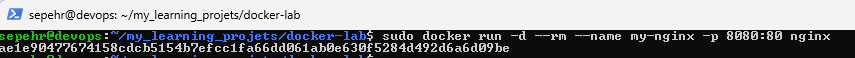
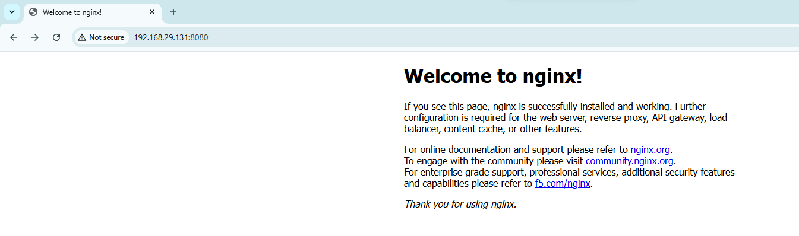

# DOCKER Learning lab

This repository contains my hands-on practice with Docker and containerization

## Docker

installed docker & containerized a web server

Tasks completed:

- Installed Docker
- ran an nginx container 
- connected port 8080 on laptop to port 80 ubuntu server
- served a containerized static webpage

## Tasks to be done

- save crutial parts on server(not container)
- serve more complicated pages on a container
