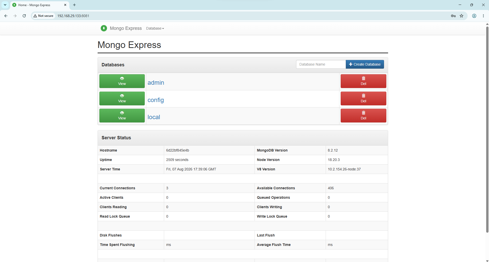
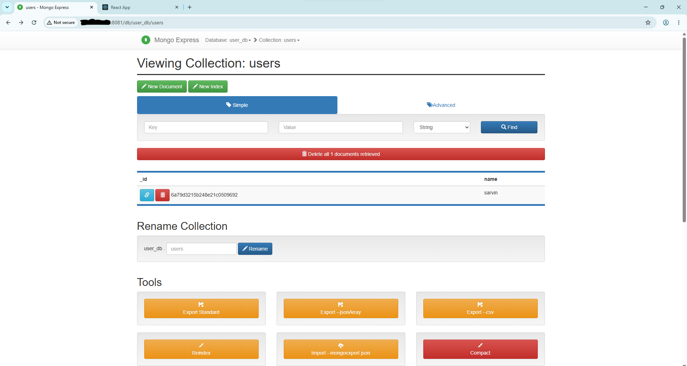
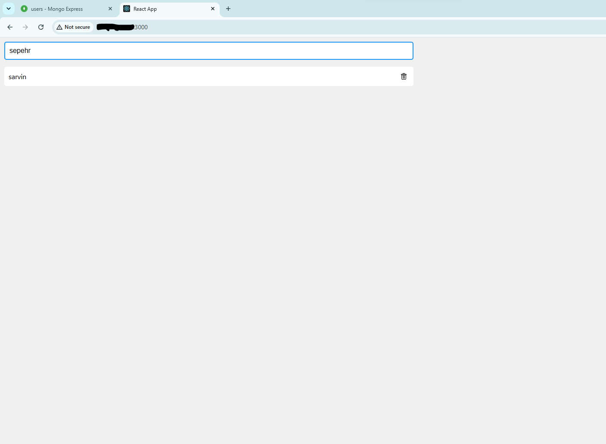
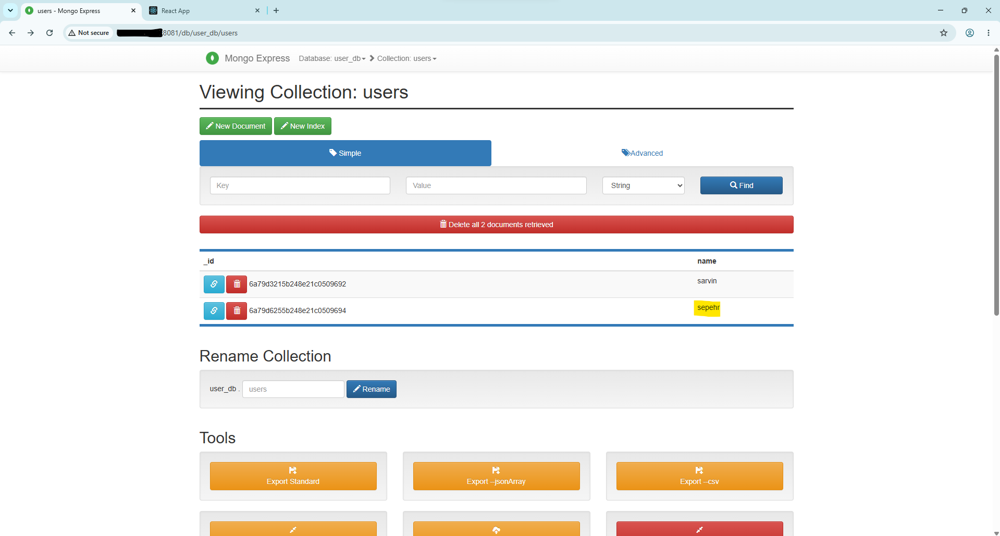

# DOCKER Learning lab

This repository contains my hands-on practice with Docker and containerization

## Docker

installed docker & containerized a web server

Tasks completed:

- Installed Docker
- ran an nginx container 
- connected port 8080 on laptop to port 80 ubuntu server
- served a containerized static webpage
- wrote a Docker-compose file (mongo.yaml)
- lunched a mongo DataBase and mongo-express for web UI
- dockerized and containerized a web containig : 
Nodejs(backend), React(frontend) & DataBase(Mongo&Mongo-Express) 

As you can see the webpage is running on port 8080 which is our container

Hid the ip for security reasons

IF we add a new user

it updates

## Tasks to be done

- save crutial parts on server(not container) 
- serve more complicated pages on a container | in progress
