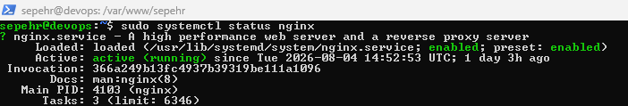

# INFRASTRUCTURE Learning Lab

This repository contains my hands-on practice while learning Linux administration, networking,web servers, and cloud infrastructure
 
The goal is to document practical tasks,configurations, and troubleshooting steps.

## Enviroment 

- Ubunthu Server
- VMWare Virtual Machine
- SSH Remote Access
- Git & GitHub

## Linux Server Setup

## Nginx

Installed and configured Nginx as a web server

Tasks completed:

- Installed Nginx
- Mabaged Nginx Service 
- Checked running status 
- served a static simple webpage

## Troubleshootin

## SSH Authentication 

Problem:
could not authenticate GitHub from ubuntu VM.

Soulution:
Configured SSH Keys and Verified GitHub authentication

## Next steps 

- Docker contianers
- Docker compose 
- ...
 
