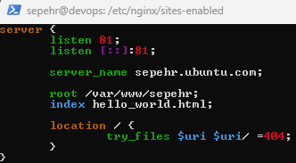
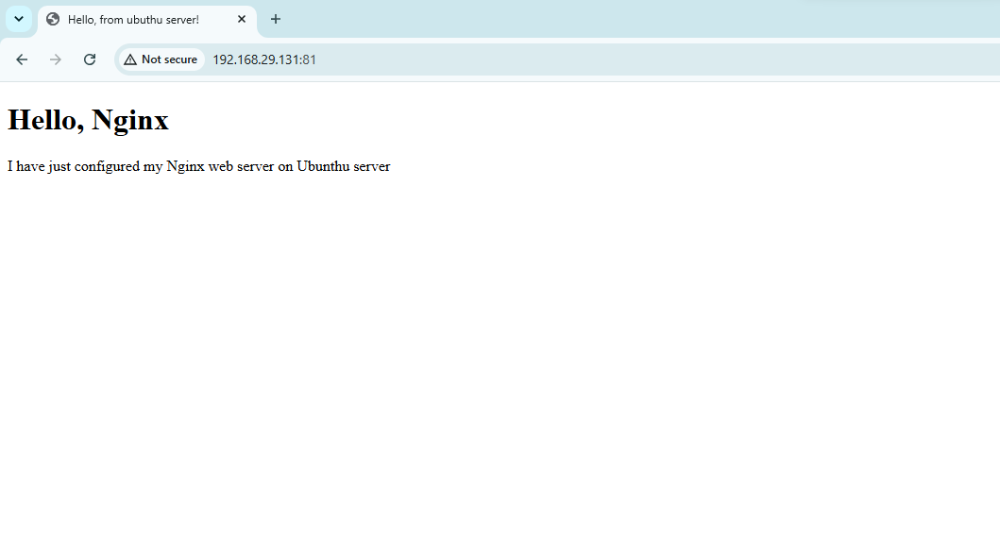

# INFRASTRUCTURE Learning Lab

This repository contains my hands-on practice while learning Linux administration, networking,web servers, and cloud infrastructure
 
The goal is to document practical tasks,configurations, and troubleshooting steps.

## Enviroment 

- Ubunthu Server
- VMWare Virtual Machine
- SSH Remote Access
- Git & GitHub

## Linux Server Setup
### Linux Bootstrap Script

This script aoutomates the initial setup of an Ubuntu Sever by:

- Updating the system
- Installing git
- Installing OpenSSH Server
- Installing Docker Engine
- Verifying docker installation

### Usage 

```bash
chmod +x bootstrap.sh
./bootstrap.sh
```

## Nginx

Installed and configured Nginx as a web server

Tasks completed:

- Installed Nginx
- Mabaged Nginx Service 
- Checked running status 
- served a static simple webpage






## Monitoring

wrote a script to check disk space and write it on a log file
optimized it with corn so it can run it every 5 minutes

## Troubleshooting

Problem: 
Nginx didn't show page on laptop  

Solution: 
changed vmware settings to bridge

## SSH Authentication 

Problem:
could not authenticate GitHub from ubuntu VM.

Soulution:
Configured SSH Keys and Verified GitHub authentication

## Next steps 

- Docker contianers DONE
- Docker compose DONE
- ...
 
